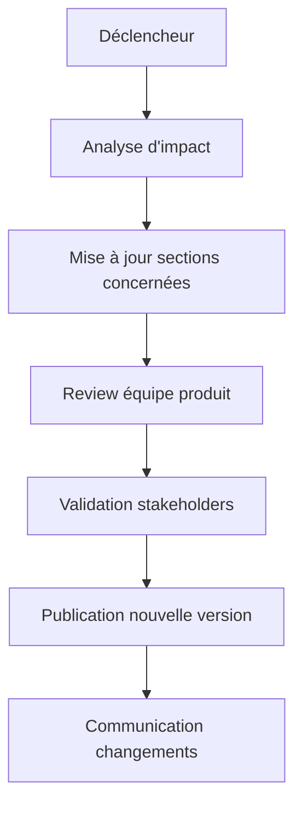

# Processus de Génération de PRD - Arkoa

## Vue d'ensemble

Ce document décrit le processus utilisé pour générer et maintenir le Product Requirements Document (PRD) d'Arkoa. Il sert de guide pour les futures mises à jour et itérations du PRD.

---

## Méthodologie de génération

### 1. Analyse du code existant

#### Sources d'information analysées :
- **`package.json`** : Technologies utilisées, scripts disponibles, dépendances
- **`src/lib/auth.ts`** : Configuration d'authentification Better Auth
- **`prisma/schema.prisma`** : Modèle de données et relations
- **`docs/README.md`** : Description générale du projet
- **Structure des dossiers** : Architecture et organisation du code
- **Dockerfile** : Configuration de déploiement

#### Informations extraites :
- **Stack technique** : Next.js 15, TypeScript, Prisma, Better Auth, PostgreSQL
- **Fonctionnalités implémentées** : Gestion des entreprises, membres, congés, soldes
- **Types de congés supportés** : 13 types différents identifiés dans le schéma
- **Rôles utilisateurs** : EMPLOYEE, MANAGER, ADMIN
- **Architecture de sécurité** : Sessions, cookies, validation Zod

### 2. Analyse des besoins métier

#### Identification des personas :
Basée sur les rôles définis dans le code et les cas d'usage typiques :
- **Employé** : Utilisateur final qui demande des congés
- **Manager** : Approuve/rejette les demandes de son équipe
- **RH/Admin** : Gère les politiques et supervise l'ensemble

#### Cas d'usage principaux :
Dérivés de l'analyse des modèles de données :
- Demande et approbation de congés
- Gestion des soldes et calculs automatiques
- Supervision et reporting
- Administration des entreprises et utilisateurs

### 3. Définition des exigences

#### Exigences fonctionnelles :
- Basées sur les entités et relations du schéma Prisma
- Complétées par l'analyse des composants UI existants
- Enrichies par les bonnes pratiques du domaine

#### Exigences non-fonctionnelles :
- Performance : Basée sur les standards web modernes
- Sécurité : Alignée sur la configuration Better Auth
- Scalabilité : Adaptée à l'architecture Next.js/PostgreSQL
- Conformité : RGPD et standards de sécurité

### 4. Structuration du document

#### Template utilisé :
Structure standard de PRD adaptée au contexte SaaS B2B :
1. Vue d'ensemble et vision produit
2. Objectifs et métriques
3. Personas et cas d'usage
4. Fonctionnalités détaillées
5. Exigences techniques et non-fonctionnelles
6. Plan de déploiement
7. Métriques de succès
8. Gestion des risques

---

## Processus de mise à jour

### Déclencheurs de mise à jour

1. **Évolution du code** :
   - Nouvelles fonctionnalités implémentées
   - Modifications du schéma de base de données
   - Changements d'architecture

2. **Feedback utilisateur** :
   - Retours des tests utilisateurs
   - Demandes de nouvelles fonctionnalités
   - Problèmes d'usabilité identifiés

3. **Évolution business** :
   - Nouveaux objectifs stratégiques
   - Changements de positionnement marché
   - Nouvelles contraintes réglementaires

### Workflow de mise à jour

### Responsabilités

- **Product Owner** : Validation des exigences business
- **Tech Lead** : Validation des exigences techniques
- **UX Designer** : Validation des exigences d'interface
- **Security Officer** : Validation des exigences de sécurité

---

## Outils et ressources

### Outils d'analyse du code
- **Prisma Studio** : Exploration du modèle de données
- **Next.js DevTools** : Analyse de l'architecture
- **ESLint/TypeScript** : Analyse de la qualité du code

### Sources de données
- **Analytics** : Données d'usage réelles
- **Support client** : Tickets et feedback
- **Surveys** : Enquêtes de satisfaction
- **Competitive analysis** : Veille concurrentielle

### Templates et standards
- **User Story Template** : "En tant que [persona], je veux [action] afin de [bénéfice]"
- **Acceptance Criteria** : Format Given/When/Then
- **Technical Requirements** : Spécifications mesurables

---

## Bonnes pratiques

### Rédaction
1. **Clarté** : Utiliser un langage simple et précis
2. **Mesurabilité** : Définir des critères d'acceptation quantifiables
3. **Traçabilité** : Lier chaque exigence à un objectif business
4. **Priorisation** : Utiliser MoSCoW (Must/Should/Could/Won't)

### Validation
1. **Cohérence** : Vérifier l'alignement avec la vision produit
2. **Faisabilité** : Valider la faisabilité technique
3. **Valeur** : S'assurer de la valeur utilisateur
4. **Complétude** : Couvrir tous les cas d'usage critiques

### Maintenance
1. **Versioning** : Utiliser un système de versions sémantiques
2. **Changelog** : Documenter tous les changements
3. **Archive** : Conserver les versions précédentes
4. **Communication** : Notifier les changements aux équipes

---

## Métriques du processus

### Efficacité du processus
- **Temps de génération** : Temps nécessaire pour créer/mettre à jour le PRD
- **Taux de changement** : Fréquence des modifications post-publication
- **Couverture** : % de fonctionnalités couvertes par le PRD

### Qualité du document
- **Feedback score** : Note moyenne des reviewers
- **Taux d'adoption** : % d'équipes utilisant le PRD
- **Précision** : % d'exigences implémentées conformément au PRD

### Impact business
- **Time to market** : Réduction du temps de développement
- **Défauts** : Réduction des bugs en production
- **Satisfaction** : Score de satisfaction des équipes

---

## Checklist de génération

### Avant de commencer
- [ ] Analyser le code source actuel
- [ ] Identifier les stakeholders clés
- [ ] Définir les objectifs de la version
- [ ] Rassembler les données utilisateur disponibles

### Pendant la rédaction
- [ ] Suivre la structure template
- [ ] Valider chaque section avec les experts
- [ ] Inclure des critères d'acceptation mesurables
- [ ] Vérifier la cohérence entre les sections

### Après la rédaction
- [ ] Review par l'équipe produit
- [ ] Validation par les stakeholders
- [ ] Test de compréhension avec des développeurs
- [ ] Publication et communication

---

## Évolutions futures du processus

### Automatisation envisagée
1. **Extraction automatique** : Parser le code pour extraire les fonctionnalités
2. **Génération de templates** : Créer automatiquement les sections de base
3. **Validation automatique** : Vérifier la cohérence et la complétude
4. **Synchronisation** : Maintenir la cohérence avec le code

### Intégrations possibles
1. **Jira/Linear** : Synchronisation avec les tickets
2. **Figma** : Intégration des maquettes
3. **Analytics** : Injection automatique des métriques
4. **Git** : Versioning automatique avec les releases

### Améliorations continues
1. **Feedback loops** : Collecte systématique des retours
2. **Templates adaptatifs** : Évolution selon les besoins
3. **Formation équipe** : Montée en compétence continue
4. **Benchmarking** : Comparaison avec les meilleures pratiques

---

## Ressources complémentaires

### Documentation interne
- [Architecture Guide](./ARCHITECTURE_GUIDE.md)
- [Technical Documentation](./TECHNICAL_DOCUMENTATION.md)
- [Security Guide](./SECURITY_GUIDE.md)

### Références externes
- [Product Requirements Document Template - Atlassian](https://www.atlassian.com/software/confluence/templates/product-requirements-document)
- [How to Write a PRD - ProductPlan](https://www.productplan.com/learn/how-to-write-product-requirements-document/)
- [PRD Best Practices - Silicon Valley Product Group](https://www.svpg.com/product-requirements-documents/)

### Outils recommandés
- **Notion/Confluence** : Rédaction collaborative
- **Miro/Figma** : Wireframes et user flows
- **Amplitude/Mixpanel** : Analytics produit
- **Hotjar/FullStory** : Analyse comportementale

---

*Ce processus est conçu pour évoluer avec l'équipe et le produit. Il doit être régulièrement évalué et amélioré.*

**Dernière mise à jour** : January 2025
**Version** : 1.0
**Propriétaire** : Product Team